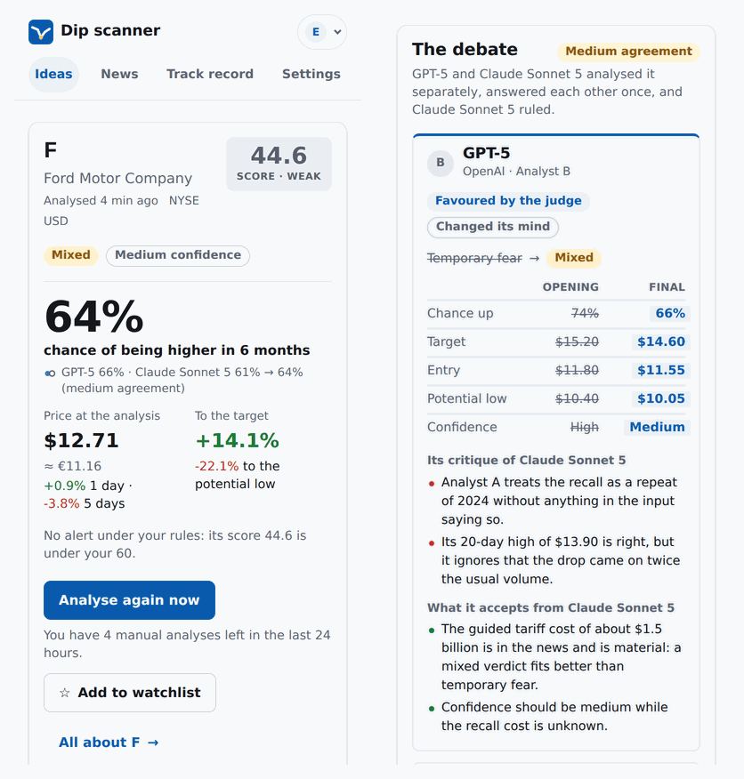
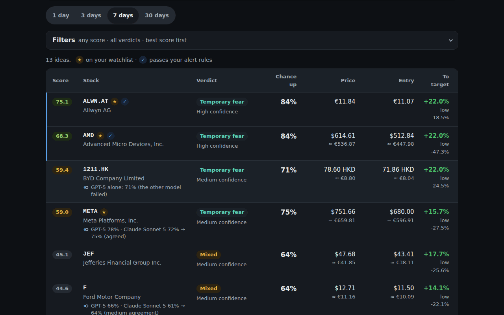
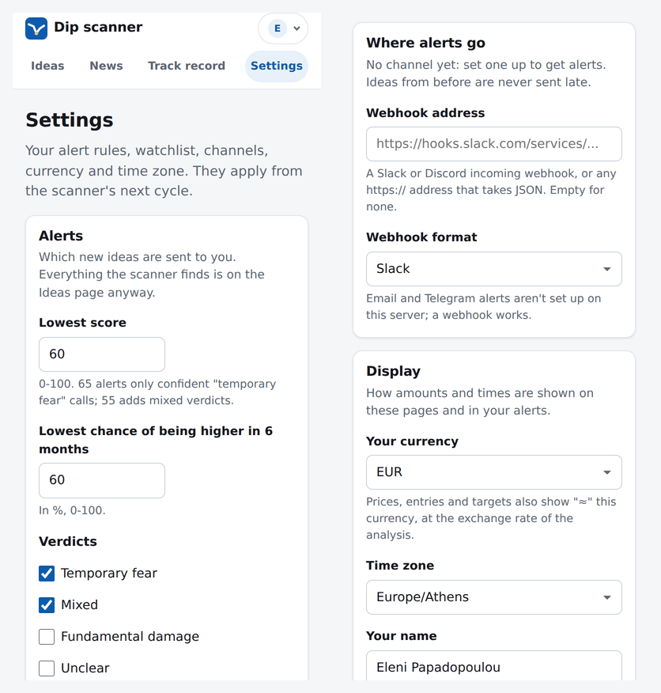

# News dip scanner

Reads about 20 financial news feeds every few minutes and has a language model work out which listed companies each
story affects. It then checks whether those shares actually fell, and asks a stronger model whether each drop is a
temporary fear or real damage to the business, or has two models (OpenAI's and Anthropic's) argue it out before a
judge. Every dip gets a chance of being higher in 6 months, a potential low, limit-order ideas and a score, and ends up
in a ranked report and, optionally, an alert.

It is a research and alerting tool. It never connects to a broker and never places orders: you do your own checks and
decide.

It runs from the command line, or as a small invite-only website for you and a few people you trust: one scanner (and
one model bill) for everybody, and each person with their own watchlist, alert rules, alert channels, currency and time
zone. The website runs on Fly.io for about $4 a month plus the models, with an optional Next.js front end on Vercel
(free on its Hobby plan) as the address people use.

**Contents:** [What it replicates](#what-it-replicates) · [How it works](#how-it-works) · [Setup](#setup) ·
[Configuration](#configuration) · [Scanning Athens stocks](#scanning-athens-stocks) ·
[Investing from a euro account](#investing-from-a-euro-account) · [Commands](#commands) · [Scoring](#scoring) ·
[Debate](#debate) · [Costs](#costs) · [Running it every 5 minutes](#running-it-every-5-minutes) · [Web app](#web-app) ·
[Deploy to Fly.io](#deploy-to-flyio) · [Security model](#security-model) · [Track record](#track-record) ·
[Limitations](#limitations) · [Risks](#risks) · [Troubleshooting](#troubleshooting) · [Development](#development)

## What it replicates

A user on r/PersonalFinanceGreece described a "hobby" system that, by their account, turned €2,500 into €57,500 in
15 months:

1. a "newsletter" collecting news from about 20 sites, refreshed every 5 minutes;
2. a ChatGPT-based step that reads the news and works out which listed companies are affected, directly or
   indirectly;
3. for those companies, a check whether the price dropped, and whether the drop is a passing "fear" or a sign the
   fundamentals are really hit;
4. a score for every opportunity: how likely the price is to rise within 6 months, and what the potential low is;
5. the human then does their own checks, places limit buy and sell orders, and reviews the open orders every couple
   of days.

This project rebuilds steps 1 to 4 as an open, configurable pipeline and adds a track record so you can see whether
the scores mean anything. Step 5 stays with you. Nothing here verifies the claimed result (see [Risks](#risks)).

## How it works

```
 feeds.toml (20 RSS/Atom feeds)
        │  every 5 min, conditional GETs (ETag / Last-Modified)
        ▼
 poll ──► new articles (deduplicated by link and by headline; translations and non-news pages dropped) ──► SQLite
        │  (data/scanner.sqlite3); only articles from the last 24 h go to the model
        ▼
 triage (small model, 20 articles per request)
        │  article ─► [{ticker, relation direct|indirect, direction, magnitude 1-5, event type, rationale}]
        ▼
 candidates: tickers with negative/mixed news in the last 48 h
        │  filters: [universe], [dip] news rules, 24 h cooldown, Yahoo Finance prices
        │  a symbol without prices is looked up by company name (renamed: OPAP.AT -> ALWN.AT)
        │  dip = down ≥3% on the day, or ≥6% over 5 days, or ≥10% below the 20-day high
        ▼
 analysis (stronger model, one request per candidate, at most 8 per cycle and 40 a day; or a debate: two models,
        │  a rebuttal and a judge where they disagree, see Debate)
        │  input: price statistics + SEC quarterly figures (US) + flagged news + per-ticker headlines
        │         (Yahoo, Google News in English and, for Athens and 5 EU exchanges, the local language)
        │  output: verdict (temporary fear / mixed / fundamental / unclear), P(higher in 6 months),
        │          potential low, entry (limit buy), target (limit sell), fear, thesis, risks, checks
        ▼
 sanity checks on the numbers ──► score 0-100 ──► reports (Markdown, HTML, JSON) ──► alerts (email, Slack,
                                                                                        Discord, Telegram, webhook)
```

## Setup

Requires Python 3.11 or newer.

```bash
cd news-dip-scanner
python -m venv .venv
source .venv/bin/activate          # Windows: .venv\Scripts\activate
pip install -e .                   # add [anthropic] or [azure] for those providers
cp .env.example .env               # Windows: copy .env.example .env
```

Then fill in `.env`:

- **A language model.** `OPENAI_API_KEY` is enough for the default: OpenAI's API (ChatGPT's models, as the original
  author used), with `gpt-5-mini` for triage and `gpt-5` for the analysis. Alternatives:
  - **Azure AI Foundry**: `LLM_PROVIDER=azure`, `FOUNDRY_ENDPOINT`, `FOUNDRY_DEPLOYMENT` (a deployment name) and
    `FOUNDRY_API_KEY`, or no key for Entra ID (`pip install -e ".[azure]"`). `LLM_TRIAGE_MODEL` and
    `LLM_ANALYSIS_MODEL` can name two different deployments.
  - **Anthropic Claude**: `LLM_PROVIDER=anthropic` and `ANTHROPIC_API_KEY` (`pip install -e ".[anthropic]"`); the
    defaults are `claude-haiku-4-5` for triage and `claude-sonnet-5` for the analysis.
  - Any OpenAI-compatible server (Ollama, LM Studio, vLLM, a gateway) through `OPENAI_BASE_URL`.
  - **Two models debating the analysis**: `LLM_ANALYSIS_MODE=debate`, with both `OPENAI_API_KEY` and
    `ANTHROPIC_API_KEY` (`pip install -e ".[anthropic]"`); triage stays with `LLM_PROVIDER`'s small model. See
    [Debate](#debate).
- **`SEC_USER_AGENT`** (recommended): your name and email, e.g. `Jane Doe jane@example.com`. The SEC requires one.
  With it the analysis gets recent quarterly figures for US-listed companies, and the SEC 8-K feed works; without it
  that feed is skipped.
- **Notifications** (optional): email, a Slack/Discord/generic webhook, or Telegram. See the comments in
  `.env.example`.

Check that everything answers, without spending anything on the model:

```bash
dip-scanner feeds --check      # fetches every feed once (without SEC_USER_AGENT the SEC feed shows as skipped)
dip-scanner prices AMD         # price statistics from Yahoo Finance
```

Then run one real cycle. This one uses the model: it triages the last 24 hours of news (about 280 articles, 14
requests, on the Sunday this was tested; more on weekdays) and analyses up to 8 candidates with the stronger model.
`--no-notify` keeps it off your alert channels (its results aren't sent later either):

```bash
dip-scanner run --no-notify    # one full cycle; prints a summary and the report's path
```

Older backlog is stored but never sent to the model. Later cycles only see what's new since the previous one.

## Configuration

| File | What's in it |
|---|---|
| `.env` | Secrets and service settings (see `.env.example`). Real environment variables win over it. |
| [`feeds.toml`](feeds.toml) | The news sources: 20 enabled, plus 14 switched off (six Greek sources and eight checked alternates). Each entry notes what it covers and when it was last verified; `exclude_titles` drops headlines that aren't news (see the file's header). |
| [`scanner.toml`](scanner.toml) | Thresholds, watchlist and alert rules. Every key is optional and the file shows the defaults; a misspelled key is an error, never silently ignored, and so is a `--config` or `SCANNER_CONFIG` file that doesn't exist. |

When the `DATA_DIR` variable is set (on Fly.io: `/data`), a `scanner.toml` or `feeds.toml` in that folder is used
instead of the one next to the program; see [changing the scanner's settings on
Fly.io](docs/DEPLOY.md#14-changing-the-scanners-settings). `--config`/`SCANNER_CONFIG` and `--feeds`/`FEEDS_FILE`
still come first.

The settings you are most likely to change in `scanner.toml`:

| Setting | Default | Meaning |
|---|---|---|
| `[scan] interval_minutes` | 5 | Minutes between cycles in `watch`. |
| `[scan] max_candidates_per_cycle` | 8 | Analyses per cycle; the rest wait for the next cycle (bounds the LLM bill). |
| `[scan] cooldown_hours` | 24 | A ticker isn't analysed again within this time unless news arrives that the last analysis didn't see, or that analysis came before any trading on its news (weekend news) and the next session moved. Only the scanner's own analyses count: a manual one ("Analyse now", `analyze`) starts neither this nor the same-session wait, so the scanner still analyses the dip and alerts it to everybody. |
| `[scan] reanalyse_same_session_hours` | 12 | Until a new session has traded since a ticker's last analysis (news in the evening, at the weekend or later the same day), new news analyses it again at most this often; the rest waits for the next session, and the same news on the same prices is never analysed twice. A further fall of `min_drop_1d_pct` lifts the wait. 0 turns it off. |
| `[scan] max_analyses_per_day` | 40 | The scanner's analyses in any 24 hours, all tickers together; candidates over it are named in the notes and wait for room (0 = no limit). Manual analyses have limits of their own (`ANALYZE_LIMIT_PER_USER`) and don't count here, so members' clicks can't keep the scanner from the day's dips. |
| `[dip] min_drop_1d_pct` / `min_drop_5d_pct` / `min_drawdown_20d_pct` | 3 / 6 / 10 | What counts as a dip (any one is enough). |
| `[dip] min_magnitude`, `directions`, `include_indirect` | 2, negative + mixed, true | Which news can make a company a candidate. |
| `[universe] watchlist` | none | Tickers that skip the magnitude and relation filters (any negative or mixed news of magnitude 1 or more, direct or indirect). They still need a dip. |
| `[universe] allowed_suffixes` | all | Exchanges by Yahoo suffix: `""` US, `.DE` Xetra, `.PA` Paris, `.AT` Athens... |
| `[universe] preferred_listings` | none | The listing you buy for a company listed in several places, e.g. `{ "ASML" = "ASML.AS" }`: its news goes there (see [Investing from a euro account](#investing-from-a-euro-account)). |
| `[alerts] min_score`, `min_probability`, `verdicts` | 65, 60, temporary fear + mixed | What gets sent as an alert. Everything is in the reports. In practice the score is what binds, and 65 is rarely reached by a "mixed" verdict (see [Scoring](#scoring)). |
| `[alerts] repeat_hours`, `min_score_change` | 24, 10 | A ticker alerted within `repeat_hours` isn't alerted again unless the score rose by `min_score_change`, the verdict changed or the price fell by another `min_drop_1d_pct`. |
| `[alerts] system_notices` | true | Tell you through the same channels when the scanner stopped or can't work (see [Running it every 5 minutes](#running-it-every-5-minutes)). |
| `[alerts] notice_after_cycles` | 6 | Cycles in a row with the model unavailable, or every feed failing, before such a notice. |
| `[account] currency` | none | Your broker account's currency, e.g. `"EUR"`: reports and alerts show price, entry and target in it too, and `track` shows returns in it. |
| `[debate] when`, `rounds` | disagree, 1 | With `LLM_ANALYSIS_MODE=debate`: rebuttals and a judge only when the two models' first analyses disagree (or always), and how many rebuttal rounds. See [Debate](#debate). |
| `[debate] max_probability_gap` / `max_low_gap_pct` | 15 / 10 | The chances up (points) and potential lows (% of the price) further apart than this count as a disagreement. |

Times in reports, alerts, summaries, notes and the log are UTC unless `DISPLAY_TZ` in `.env` names another IANA time
zone (`Europe/Athens`, `Europe/Berlin`, `America/New_York`), shown with its abbreviation: `2026-09-25 18:00 EEST`. A
name the system doesn't know is a configuration error; on Windows the names come from the `tzdata` package, which is
installed with the scanner there. The database, the report file names and the model's daily use (counted from 00:00
UTC) stay in UTC.

Tickers are Yahoo Finance symbols: `AMD`, `BRK-B`, `SAP.DE`, `ASML.AS`, `ALWN.AT`, `7203.T`, `0700.HK` (in the
watchlist and exclude lists `BRK.B` or `NASDAQ:TSLA` work too). Only company shares become candidates: ETFs, funds
and indices are left out, and so is a fund that Yahoo lists as a share but whose name says "Fund" or "ETF".

The triage model knows the symbols of its training data, and some have changed since: OPAP became Allwyn (`OPAP.AT`
is now `ALWN.AT`), Mytilineos became Metlen (`MYTIL.AT` is now `MTLN.AT`). When Yahoo has no prices for a symbol, the
scanner searches Yahoo Finance for the company name the triage gave and takes the same company's shares on the same
exchange (for a symbol without a suffix, a main US exchange, not OTC): a listing with the same name or its initials,
anywhere in Yahoo's list ("Allwyn" is Allwyn AG, "PPC" Public Power Corporation), or one with a longer name that
starts with it ("Metlen": Metlen Energy & Metals PLC) only when no other company on Yahoo's list starts the same way
and one of the stories names it. Funds, notes, partnerships and warrants never match. Its news moves to that symbol,
the notes say `OPAP.AT -> ALWN.AT (Allwyn AG)`, the answer is kept for 7 days, and `analyze ALWN.AT` and `news
--ticker ALWN.AT` include that news too. News about companies that were taken over or delisted (Hess, Credit Suisse)
stays in the "No prices" note: Yahoo's search lists related instruments for them (Hess Midstream LP, a bond fund),
which are not the company. A wrong match is undone by adding the symbol before the arrow to `[universe] exclude`.
With `only_watchlist`, or news that only the watchlist's leniency lets through, the old symbol is looked up first when
the watchlist has a symbol on its exchange, so an Allwyn story filed as `OPAP.AT` still reaches `ALWN.AT`. This needs
the current name: Yahoo no longer finds "OPAP", so a story the model filed as "OPAP" stays unresolved (the prompt asks
for the name the article uses). Greek letters are read as the Latin ones of Athens codes (`ΕΤΕ.ΑΤ` is `ETE.AT`, and a
Greek code without an exchange is an Athens one: `ΜΟΗ` is `MOH.AT`), Cyrillic ones that look like Latin letters as
those.

### Website settings

The website (`dip-scanner serve`) takes these from `.env` or the environment as well; the command line doesn't need
them, except `BASE_URL` for the links `dip-scanner users` prints.

| Setting | Default | Meaning |
|---|---|---|
| `SECRET_KEY` | none | A random secret of at least 32 characters, required by the website: `python -c "import secrets; print(secrets.token_urlsafe(48))"`. |
| `BASE_URL` | none | The website's address, e.g. `https://my-dips.fly.dev`: invite and password links point at it. |
| `COOKIE_SECURE` | true | The session cookie only travels over https; `false` only for testing on `http://localhost`. |
| `ANALYZE_LIMIT_PER_USER` | 5 | Manual analyses ("Analyse now") a member may start in 24 hours; admins have no limit, 0 turns them off for members. |
| `SCANNER_ENABLED` | true | Run the scanner inside the website's process; `false` serves the pages only. |
| `PROXY_SECRET` | none | Behind a front door (the Next.js app on Vercel): a random secret of at least 32 characters, the same as the front door's `DIP_PROXY_SECRET`. Every request but `/healthz` must then carry it (header `x-dip-proxy-secret`), so the Fly address answers nobody else, and `BASE_URL` must be the front door's address. |
| `TRUSTED_ORIGINS` | none | Addresses whose form posts are accepted besides `BASE_URL`'s, comma-separated (`https://my-dips-git-main-my-team.vercel.app`), and at most one pattern for every preview deployment of one Vercel project: `https://my-dips-git-*-my-team.vercel.app`, the project's name before the `*` and the team's after it. |

The pages, how to try the website on your own computer and how each user's alerts work are under
[Web app](#web-app); what keeps the accounts safe is under [Security model](#security-model).

The front door reads the website's data from a JSON API under `/api/v1` (`web/api.py`) with the visitor's session
cookie: `me`, `status`, `ideas` (the dashboard's list, with filters and pages), `ideas/{id}` (everything the idea page
shows), `POST ideas/{id}/reanalyse` ("Analyse again", with the `X-CSRF-Token` header), `jobs/{id}` and
`thesis-changes`. Its contract is [`frontend/contract/api-v1.schema.json`](frontend/contract/api-v1.schema.json), a
JSON Schema that the tests check every answer against; errors are JSON too (`{"error": {"code", "message",
"retry_after"}}`), with the same limits as the pages.

## Scanning Athens stocks

The enabled feeds are English and mostly about US and large European companies. To cover the Athens Exchange too:

1. **Feeds.** In `feeds.toml`, set `enabled = true` for the Greek sources you want. `mononews` (Athens companies,
   banks, analyst calls) and `ot-gr` (a business daily) carry the most company news; `naftemporiki` is more
   economy and personal finance; `newmoney`, `powergame` and `sofokleousin` add similar stories with more politics,
   world news and sport. All six answered on 2026-09-27 (see the comments there); run `dip-scanner feeds --check`
   from your own connection. Capital.gr refuses feed requests from cloud servers and was left out. Each enabled
   feed adds triage requests for its non-company stories (see [Costs](#costs)).
2. **Exchanges.** Every exchange is allowed by default. To look at US and Athens listings only, set
   `[universe] allowed_suffixes = ["", ".AT"]` in `scanner.toml` (with `preferred_listings`, add their exchanges
   too, e.g. `".AS"` for `ASML.AS`: a preferred listing the setting leaves out is a configuration error).
3. **Watchlist.** Any negative or mixed news about a watchlist ticker counts, however small or indirect. Current
   Yahoo codes, each checked with `dip-scanner prices` on 2026-09-27:

   ```toml
   [universe]
   watchlist = [
       "ETE.AT",       # National Bank of Greece
       "EUROB.AT",     # Eurobank
       "TPEIR.AT",     # Piraeus Bank
       "ALPHA.AT",     # Alpha Bank
       "HTO.AT",       # OTE (Hellenic Telecommunications Organization)
       "PPC.AT",       # PPC (Public Power Corporation)
       "ALWN.AT",      # Allwyn, formerly OPAP (OPAP.AT has no prices any more)
       "MTLN.AT",      # Metlen Energy & Metals, formerly Mytilineos (MYTIL.AT has no prices any more)
       "BELA.AT",      # Jumbo
       "MOH.AT",       # Motor Oil
       "ELPE.AT",      # HELLENiQ ENERGY
       "GEKTERNA.AT",  # GEK TERNA
       "AKTR.AT",      # Aktor
       "AEGN.AT",      # Aegean Airlines
       "TITC.AT",      # Titan
   ]
   ```

Known limits:

- **No fundamentals.** They come from SEC filings, which Athens companies don't make. The analysis rests on the news
  and the price data; the model is told that this is expected and not to lower its confidence for it, but read the
  company's latest results before acting on a verdict.
- **Thinner news.** Few English sources follow Athens companies, and the Greek feeds mix them with much else. The
  per-ticker context headlines of an analysis come from Google News in Greek as well as English ("Jumbo μετοχή" for
  BELA.AT; the same for Xetra, Paris, Milan, Madrid and Amsterdam listings in their languages), but only headlines
  that name the company in Latin letters or its symbol are kept. A one-word name counts only as a name (capitalised,
  and not in the publisher's name at the end of a Google headline), and the English search looks for Yahoo's full
  name or the symbol (`"Titan S.A." OR TITC stock`): "Titan stock" finds Titan Company in India, Titan Mining and
  "tech titan". Companies the Greek press calls by a Greek name (ΔΕΗ for PPC, ΕΤΕ or Εθνική for National Bank of
  Greece) get fewer: on 2026-09-27 Jumbo and Allwyn got 15 context headlines each, Titan 4 (3 about the Greek company;
  12 of 15 had been about other Titans before these rules), National Bank of Greece 8, PPC and OTE 1.
- **Greek text.** The triage prompt says that articles can be in any language and asks for English answers,
  symbols in Latin letters and the company's current name. The prompts haven't been tested against a live model
  (see [Limitations](#limitations)); run `dip-scanner news` after a few cycles to see what it made of the Greek
  stories.
- **Alerts.** With the default `[alerts]` only confident "temporary fear" calls alert, on any exchange (see
  [Scoring](#scoring)).

## Investing from a euro account

The prices, entries and targets are in the currency a stock trades in, and so are the returns in `track`. From a
euro account, a US stock is also a bet on the dollar:

- **Currency risk is a big share of the target.** EUR/USD moved 7.3% a year (annualised daily volatility, 2016-2026,
  Yahoo's `EURUSD=X`), about 5% over six months; since 2016 the median six-month move was 2.9% and one in four was over
  6%. Next to a typical 10-20% target from the analysis, that decides many outcomes: +15% in dollars while the dollar
  loses 6% against the euro is about +8% in euros.
- **Conversion fees.** Most brokers convert at a spread or a fee of a few tenths of a percent, on the buy and again on
  the sale; check your broker's fee schedule.
- **Minimum commissions.** On a small account these weigh more than the fee in percent: with a €7 minimum, a €500
  order pays 1.4% to buy and 1.4% to sell, before any currency cost. Fewer, larger orders cost less.

`[account] currency = "EUR"` in `scanner.toml` makes this visible. Reports and alerts then show price, entry and
target in euros too (`$132.00 ≈ €115.93`), at Yahoo Finance's exchange rate when the analysis was made (the report
names the rate; your broker's rate and fee differ), and `track` adds the return in euros, exchange-rate moves
included, next to the return in the trading currency (see [Track record](#track-record)). The rate is fetched from
Yahoo's chart API like the prices (`EURUSD=X`, `EURGBP=X`...; pence, cents and agorot are converted through pounds,
rand and shekels). Without a rate the amounts stay in the trading currency and the notes say so. Opportunities
analysed before the setting keep showing their trading currency only.

Many large European companies trade in New York too (ASML, SAP, TotalEnergies, Stellantis), and the triage names the
listing the article is about, often the US one. `[universe] preferred_listings` moves a company's news to the listing
you would buy, so it is analysed there, with prices, entry and target in euros and no conversion:

```toml
[universe]
preferred_listings = { "ASML" = "ASML.AS", "SAP" = "SAP.DE", "TTE" = "TTE.PA", "STLA" = "STLAM.MI" }
```

All eight symbols answered on 2026-09-27. The map applies to every new triage answer and to news stored before it was
set (in scans, `analyze` and `news`), watchlist and exclude entries are read through it (`"ASML"` on the watchlist
means `ASML.AS`), and news filed under both symbols counts once, for the preferred one. The analysis still gets the
company's SEC figures, looked up under the US symbol (ASML, SAP, TotalEnergies and Stellantis all file with the SEC).
Pick the company's home exchange (Amsterdam for ASML, Xetra for SAP): secondary listings trade less, at wider
spreads. A preferred listing on an exchange that `[universe] allowed_suffixes` leaves out is a configuration error:
add its suffix there.

## Commands

After `pip install -e .`, `dip-scanner` works as a shorthand for `python -m dip_scanner`.

| Command | What it does | Needs a model |
|---|---|---|
| `dip-scanner run [--no-notify]` | One cycle; prints a summary, the day's model use, notes on what was skipped and why, and the report's path. | yes |
| `dip-scanner watch [--interval MIN] [--no-notify]` | Cycles on the interval until Ctrl+C; each logs a summary ending with the day's model use. | yes |
| `dip-scanner feeds [--check]` | Lists the feeds and how their last fetch went; `--check` fetches each one now. | no |
| `dip-scanner news [--hours 24] [--ticker T]` | The news digest ("newsletter"): companies with negative news first, then the other headlines. Stories are listed under the symbol a scan reads them as (the preferred listing, or the symbol found for an old one). | no |
| `dip-scanner analyze TICKER [--no-save]` | Analyses one ticker now, whatever its price did and ignoring the cooldown, with the news filed under its old symbol or its preferred listing's other symbol. | yes |
| `dip-scanner report [--days 7] [--min-score N] [--html PATH]` | The stored opportunities of the last days. | no |
| `dip-scanner track [--days 365]` | How past opportunities played out, next to their exchange's index (see [Track record](#track-record)). | no |
| `dip-scanner prices TICKER` | Price statistics and whether they count as a dip. | no |
| `dip-scanner serve [--host 127.0.0.1] [--port 8080] [--no-scanner]` | The website (see [Website settings](#website-settings)), with the scanner running in the same process unless `--no-scanner` or `SCANNER_ENABLED=false`. A setup problem (no key, no credit) stops only the scanner: the pages keep working, say why, and an admin can start it again. | for the scanner and "Analyse now" |
| `dip-scanner users add-admin EMAIL [--name NAME]` | Creates the website's admin (or makes an existing user one) and prints a one-time link to set the password, valid for 48 hours. | no |
| `dip-scanner users invite [EMAIL] [--role member\|admin]` | Prints a single-use invite link, valid for 7 days (with EMAIL, only that address can use it). | no |
| `dip-scanner users list` | The website's accounts (role, status, last login, alert channels) and unused invites. | no |
| `dip-scanner users disable EMAIL` / `enable EMAIL` | Disables an account (signed out at once, can't sign in) or enables it again. | no |
| `dip-scanner users reset-link EMAIL` | Prints a one-time link to choose a new password, valid for 48 hours. | no |
| `dip-scanner users unlock EMAIL` | Forgets an email address's failed sign-ins (see Limits under Security model), so it can sign in again at once. | no |
| `dip-scanner backup [--keep 7]` | A consistent copy of the database in `DATA_DIR/backups/scanner-YYYYmmdd-HHMMSS.sqlite3` (UTC), taken while the scanner runs; only the newest copies are kept. | no |

Options for every command: `-v` (debug logging), `--env-file PATH`, `--config PATH`, `--feeds PATH` and
`--data-dir DIR`. Exit codes: 0 ok, 1 runtime error, 2 configuration error.

The `users` commands print links on `BASE_URL` (see [Website settings](#website-settings)); the links carry one-time
tokens, so share them only with the person they are for. A backup is a complete database: to restore one, stop the
scanner and copy it over `scanner.sqlite3` (and delete `scanner.sqlite3-wal` and `scanner.sqlite3-shm` if they are
there).

### Output

Everything goes to `data/` (or `DATA_DIR`):

- `scanner.sqlite3`: articles (kept 30 days), company impacts, feed state, every model call with its tokens (kept
  30 days) and every opportunity (kept for good).
- `reports/YYYY-MM-DD/HHMMSS-opportunities.md`, `.html` and `.json`, written by each cycle that found something,
  plus `reports/latest.md` and `latest.html`. The HTML is a single email-safe file. Its score badges use the same
  bands as the track record: 80+ strong, 65-80 good, 50-65 fair, under 50 weak.
- `cache/sec/`: the SEC ticker list (a day) and each company's figures (12 hours).

Each opportunity in the report shows the price and recent moves, the chance of being higher in 6 months, the
potential low and the statistical low, the entry (limit buy) and target (limit sell idea), the upside to the target
and downside to the low twice (from the price at the analysis, and from the entry, which is what the two limit
orders would make or lose), the verdict and confidence, what the market fears, the fundamental impact, the thesis,
risks, catalysts, what to check before buying, and the headlines that flagged it. With `[account] currency` set,
price, entry and target also show their value in your currency, with the exchange rate used.

Alerts go to every configured channel. Email and generic webhooks get the full report; Slack, Discord and Telegram
get one line per opportunity (and a second one for its [debate](#debate), if it had one). The rules:

- **Retries**: an alert that couldn't be sent is retried for 24 hours, labelled "not sent earlier" with its age. It
  counts as delivered once any one channel took it, so a channel that was down at the time doesn't get it later.
- **One analysis per ticker**: when a ticker has been analysed again since, only the newest analysis counts; an
  older unsent alert is dropped, also when the newer analysis is no longer an alert.
- **No repeats**: a busy story means a new analysis for every new article, but a ticker alerted within
  `[alerts] repeat_hours` is only alerted again when something material changed (see the table above).
- **Thesis changes**: when a ticker alerted in the last 6 months is analysed again and fails a rule of `[alerts]`
  that the alert passed, or its chance of being higher fell by 20 points or more, you get a "Thesis change: ... review
  open orders" notice saying what changed. An alert you got counts even when you made your rules stricter since (you
  may have orders on it); stricter rules alone are no thesis change. In `report` and `track`, an older analysis with a
  newer one is marked superseded.
- **Nothing is queued silently**: results of `run --no-notify` or `watch --no-notify`, of cycles run before any
  channel was set up, and of `dip-scanner analyze` (you've just read it) are never sent later.
- **Each on their own**: on the website every user's alerts follow their own rules, and repeats, retries and thesis
  changes are counted per user, so one user's channel being down never marks another's alert as sent. A user's alerts
  start when they set up their first channel.

A channel that is only half set up is skipped with a warning naming the missing setting, and Discord messages can't
ping anyone (mentions are turned off). Chat messages don't include the report's local path.

## Scoring

**Severity** only orders the candidates within a cycle (bigger, better-explained drops are analysed first):

```
severity = drop + news + corroboration + volume
  drop          = max(0, -change_1d, -change_5d / 1.5, -drawdown_from_20d_high / 2)      (in %)
  news          = 1.5 × strongest impact's magnitude × relation (direct 1, indirect 0.5)
                        × direction (negative 1, mixed 0.7, other 0.3)
  corroboration = 0.5 per further story about the company (copies of one headline count once), at most 2
  volume        = min(3, volume_ratio - 1) when the day traded above its 20-day average volume
```

During the session `volume_ratio` compares the volume so far with the same share of a normal day (the session
counts as at least 10% done), so heavy early selling shows as a high pace, not as "below average".

**Score** (0-100) ranks the opportunities:

```
prob          = probability_up_6m / 100
up            = max(0, target_price / price - 1)
down          = max(0.01, 1 - potential_low / price)
reward_risk   = up / (up + down)                      # 0.5 = as much upside as downside
score = 100 × (0.7 × prob + 0.3 × reward_risk) × verdict_factor × confidence_factor

verdict_factor:    temporary fear 1.0, mixed 0.85, unclear 0.7, fundamental 0.5
confidence_factor: high 1.0, medium 0.93, low 0.85
```

Example: 68% chance up, low 118, entry 132, target 168 at a price of 142.50, temporary fear, medium confidence:
score 58.5, which the default `[alerts] min_score` of 65 doesn't alert on.

What the default alert rules mean in practice: the potential low is anchored near the statistical 6-month low and
the target near the pre-drop high, so `reward_risk` is usually 0.2-0.4. A score of 65 then needs a chance up of
about 76-85% for a "temporary fear" verdict at high confidence, and 93% or more for "mixed" at high confidence,
above the 90% the model is told not to exceed. So with the defaults only confident temporary-fear calls alert; set
`min_score = 55` if you want mixed verdicts too (mixed, high confidence, 80%, reward_risk 0.3 scores 55.2).
`min_probability` only matters when the upside is over about 3.8 times the downside.

Listings outside the US (Athens, Xetra, Paris...) get no fundamentals: they come from SEC filings only. The model is
told that this is expected for such a listing and to judge its confidence on the news and the price data, not to
lower it because figures are missing. Otherwise they could hardly ever alert: "low" confidence multiplies the score by
0.85, and then even a 90% chance with a reward/risk of 0.43 scores 64.5. Their verdicts still rest on less
information, so read the company's latest report before acting on one.

Before scoring, the model's numbers are checked and fixed where they contradict each other, with a warning in the
report: the probability is clamped to 0-100; a potential low at or above the price becomes the lower of the
statistical 6-month low and 97% of the price, and one below 30% of the price is raised to that; the entry is clamped
between the low and the price; a target at or below the entry becomes entry × (1 + max(5%, half the annual
volatility)); a target above both the 52-week high and `price × exp(2 × volatility × √0.5)` (2 standard deviations of
6-month volatility) is lowered to that ceiling, so a slipped decimal can't inflate the score.

The "statistical 6-month low" in the price block is the 5th percentile of the price at the 6-month mark in a
zero-drift lognormal model: `price × exp(-1.645 × volatility × √0.5)`. The lowest price along the way falls below it
about twice as often (roughly 1 in 10), and the price block says so. The model is told to use it, and the worst
6-month drawdown in the price history, as anchors for its potential low.

## Debate

With `LLM_ANALYSIS_MODE=debate` two models analyse every dip instead of one, argue where they disagree, and a judge
rules. By default they are OpenAI's `gpt-5` and Anthropic's `claude-sonnet-5`, and the [Fly.io
deployment](#deploy-to-flyio) runs this way. Triage stays with one small model: it reads every headline all day, and a
mistake there only costs a look at the wrong company.

How one dip is debated (`dip_scanner/debate.py`):

1. **Openings.** Both models get exactly the prompt a single analysis gets, at the same time, and each answer is
   checked and fixed like a single analysis (see [Scoring](#scoring)).
2. **Do they disagree?** Fixed rules, no model involved. The two first analyses disagree when their verdicts differ,
   their chances of being higher are more than `[debate] max_probability_gap` (15) points apart, their potential lows
   are more than `max_low_gap_pct` (10%) of the price apart, or one of them would alert somebody and the other
   wouldn't (anyone's score, chance and verdict rules: `[alerts]`, and on the website each user's own). With `when =
   "disagree"` (the default) two analyses that agree are merged and nothing else runs: the shared verdict, the
   average chance (rounded) and target, the lower potential low, entry and confidence, one model's texts, and both
   models' risks and checks. That mix can score below both analyses (the lower low and confidence with the average
   chance), so when the merged numbers would alert somebody differently from both analyses, they are debated after
   all.
3. **Rebuttal** (`rounds`, 1 by default; 0 to 3). Each model sees its own analysis and the other's, which it only
   knows as "the other analyst", and answers with its final analysis, a critique (up to 5 points where the other is
   wrong, unsupported by the news and data given, or uses facts that aren't in them; the other's own levels and
   chance are estimates, judged against the price data rather than called invented), its concessions and whether it
   changed its mind. It is told to argue from the input only, not to defer to the other or to a consensus, not to split
   the difference, and to change its position only for evidence it had missed.
4. **Judge.** One model reads the case and the two final analyses with their critiques, and rules: the final
   analysis, a summary of 2-4 sentences (how far they agreed, the crux, how it was settled), the agreement (high,
   medium or low) and whose case held up better. It sees the two labelled "Analyst A" and "Analyst B", in an order
   fixed per stock and day by a hash that doesn't say which model wrote which; the models' names are replaced by "the
   analyst" in both positions (whole words, not when the news itself is about that model, as with a GPT-5 launch),
   and every model is told not to name itself or guess who wrote the other analysis. It is told to decide on the
   evidence and the reasoning, not on confidence, length or majority, to give invented facts no weight, and to lower
   its confidence and prefer "mixed" or "unclear" when the input can't settle the question. With `LLM_DEBATE_JUDGE`
   `alternate` (the default) the two models take turns as judge, by another hash of stock and day, so neither side
   always judges; `openai`, `anthropic` or any `provider:model` fixes the judge.
5. **Guardrails** on the ruling, listed in the report like other fixed numbers: its chance stays within 5 points of
   the two models' final chances, its potential low within 5% of the price of theirs; its confidence is at most "low"
   when opposite verdicts are involved (temporary fear against fundamental damage, the ruling's own included), at
   most "medium" when the two final verdicts differ or the ruling's verdict differs from both, and never higher than
   the more confident of the two; then the usual checks of [Scoring](#scoring) apply. The agreement shown is the
   lower of the judge's and the one the fixed rules give for the two final analyses, so opposite verdicts never read
   as "high agreement".

**When a model fails.** When one of the two can't give its first analysis (a refused key, no credit, an outage, an
unusable reply), the other's analysis stands alone, the report says so, and a notice such as "dip-scanner: Anthropic
unavailable, analysing with OpenAI only" goes to the alert channels, at most once every 12 hours per provider: the
scanner keeps running. A failed rebuttal keeps that model's earlier analysis (the idea page and report say so), and
a failed judge leaves the two final analyses merged by the rule above, except that opposite verdicts merge to
"unclear" rather than to the more cautious one; a judge that can't be used at all (a wrong `LLM_DEBATE_JUDGE`, a
refused key) also sends a notice, at most once every 12 hours. Only when both models fail does the analysis fail, as a single model's would.

**Settings.** In `.env` (on Fly.io, `fly.toml`'s `[env]`):

| Setting | Default | Meaning |
|---|---|---|
| `LLM_ANALYSIS_MODE` | `single` | `debate` turns the debate on (`single`: one analysis model, `LLM_PROVIDER`'s). |
| `LLM_DEBATERS` | `openai:gpt-5,anthropic:claude-sonnet-5` | The two models as `provider:model` (`azure:<deployment>` for Azure AI Foundry). Each needs its provider's key: a missing one stops the scanner with a message naming it. |
| `LLM_DEBATE_JUDGE` | `alternate` | Who rules: `alternate`, `openai` or `anthropic` (that debater's model), or any `provider:model`. |

and `[debate]` in `scanner.toml` (see [Configuration](#configuration)). OpenAI and Azure debaters (and judges) use
`LLM_ANALYSIS_REASONING_EFFORT` like a single analysis model; Claude runs at its default effort, since the two
providers' levels differ (`low` to save on GPT-5 would starve Claude, and Claude's `max` is an error for GPT-5).

**Use `when = "disagree"`.** When the two first analyses agree, a rebuttal and a ruling mostly restate them, and they
cost three more calls. The debate earns its cost on the dips where the models read the news differently, which are
the ones where a single model's confident call is least reliable. `when = "always"` debates every dip (see
[Costs](#costs)).

**What you see.** Reports and `dip-scanner analyze` add a Debate block after the key figures: how it went, the judge's
summary, each model's first and final verdict, chance and potential low and whether it changed its mind, and each
one's main critique points. Chat alerts add a line such as `Debate: GPT-5 72% · Claude Sonnet 5 58% → 64% (medium
agreement)`: each model's final chance, then the outcome's. An analysis says whose it is ("debate: gpt-5 vs
claude-sonnet-5, judged by claude-sonnet-5"). The day's model use in `run`, `watch` and on the admin page lists the
openings, rebuttals and rulings per model, and [`dip-scanner track`](#track-record) scores each model once debated
dips have 6 months of results. `[scan] max_analyses_per_day` and `ANALYZE_LIMIT_PER_USER` count dips analysed, not
calls: a debate is one analysis, whatever it cost.

## Costs

The request counts and prompt sizes below come from a live run of the feeds (2026-09-27); the output token counts are
assumptions, since no live model was run. All of it is an estimate, not a quote. Check your provider's current prices.

- **Triage**: one request per cycle that has new articles, with up to 20 articles each. Every request carries a
  fixed prompt of about 5,200 characters (about 1,300 tokens) plus about 300 characters per article, and gets a
  short JSON reply. At the 5-minute interval most requests carry only 1-3 articles (a full batch of 20 only happens
  after a backlog, about 2,500-3,000 tokens), so expect roughly 150-290 triage requests a day: the live Sunday run
  measured 162 requests for about 440 fresh articles, about 1,400 tokens each on average (with the prompt at 4,700
  characters then; about 100 tokens more per request now). That is about 0.2-0.5
  million input tokens a day for triage, most of it the fixed prompt repeated every cycle; a longer
  `interval_minutes` cuts it about proportionally (15 minutes: about 96 requests a day).
- **Analysis**: one request per candidate, about 3,500 input tokens (price block, fundamentals, up to 12,000
  characters of news) and a reply of 500-1,000 tokens. A new qualifying article about a ticker analyses it again
  (its alert is only repeated when something material changed), up to `max_candidates_per_cycle` per cycle. Until
  a new session has traded (evenings, weekends, later the same day) that happens at most every
  `reanalyse_same_session_hours` (12) unless the price fell further, and `max_analyses_per_day` (40) caps the day,
  so a busy news day can't run up the bill. Expect a handful to a few dozen a day.
- **Total**: roughly 0.25-0.6 million input tokens a day. Reasoning models also bill their thinking as output
  tokens, which is where most of the money goes.

**What that costs a month.** With OpenAI's list prices for the default models, checked on 2026-09-28 (gpt-5-mini
$0.25 per million input tokens and $2 per million output tokens, gpt-5 $1.25 and $10; prices change, check the
provider's page), and the request counts above, 30 days of `watch` at the 5-minute interval:

| Day | Triage (gpt-5-mini) | Analysis (gpt-5) | A day | A month | In euros |
|---|---|---|---:|---:|---:|
| Quiet | 150 requests, 300 output tokens each | 5 analyses, 2,000 output tokens each | $0.27 | about $8 | €7 |
| Typical | 220 requests, 500 output tokens each | 15 analyses, 3,500 output tokens each | $0.89 | about $27 | €24 |
| Busy every day | 290 requests, 1,000 output tokens each | 40 analyses (the daily cap), 5,000 each | $2.86 | about $86 | €75 |

Input is 1,500 tokens per triage request and 3,500 per analysis; the output counts include reasoning at
`LLM_TRIAGE_REASONING_EFFORT=low` and the analysis model's default effort, and are assumptions: no live model was run
for this README. The euro figures use 1 EUR = 1.1386 USD. Anthropic's defaults (claude-haiku-4-5 at $1 and $5,
claude-sonnet-5 at $2 and $10) come to about $18-95 a month for the same days. Haiku gets no reasoning (it doesn't
take the effort setting), so that assumes a triage reply of about 300 output tokens every day; the difference is
mostly Haiku's input, which costs four times gpt-5-mini's.

**With the debate** (`LLM_ANALYSIS_MODE=debate`: gpt-5 against claude-sonnet-5, at Anthropic's list price of $2 per
million input tokens and $10 per million output tokens, checked on 2026-09-28; triage as above). Every call's reply is
counted like an analysis reply of that kind of day. The input is 3,500 tokens for a first analysis, 5,500 for a
rebuttal (the case and both analyses) and 6,000 for the ruling (the case and both final analyses with their
critiques), and each model judges half the time. A dip on which the two models agree costs two calls, about twice a
single analysis ($0.08 instead of $0.04 on a typical day); a debated one five calls, about 5.4 times ($0.21). A month
of 30 days, triage included, if half the dips are debated with `when = "disagree"`:

| Day | One model (`single`) | Debate, `when = "disagree"` | Debate, `when = "always"` |
|---|---:|---:|---:|
| Quiet | about $8 (€7) | about $19 (€16) | about $25 (€22) |
| Typical | about $27 (€24) | about $76 (€66) | about $105 (€93) |
| Busy every day | about $86 (€75) | about $261 (€229) | about $368 (€323) |

With `when = "disagree"` a typical month costs between about $46 (the models always agree) and $105 (they never do).
Busy days cost most because of `[scan] max_analyses_per_day`, which counts dips, not calls: in debate mode, 20 instead
of 40 halves the worst case. How often the two models disagree is unknown until they have run for a while: the admin
page shows the cost per step (openings, rebuttals, rulings) and model, and a month estimate from the days so far.

The six Greek feeds (see [Scanning Athens stocks](#scanning-athens-stocks)) add about 60% more articles to triage
(148 of 396 on the Sunday measured, with slightly longer items, and Greek takes more tokens per character than
English). Most of a triage request is the fixed prompt, so the cost is mostly more cycles with something new: at most
one request per cycle, 288 a day at the 5-minute interval instead of about 220, which is roughly $3 a month more on
typical days with the default OpenAI models.

Next to the Reddit author's starting capital of €2,500, a year of typical days costs about €280, 11% of the account,
and a year of busy ones about €900, 36%, before a single trade and before broker fees; with the debate on
disagreement, a year of typical days about €800, a third of the account (see
[Investing from a euro account](#investing-from-a-euro-account)). The scanner has to find a lot of good trades to pay
for itself on an account that size. To keep the bill down:

- Set `LLM_TRIAGE_REASONING_EFFORT=low`: triage only maps headlines to companies, all day long. If a triage reply
  takes about 1,800 output tokens at the model's default effort instead of 500, the typical month costs about $17
  more. `LLM_ANALYSIS_REASONING_EFFORT=low` makes the analysis cheaper too, at some cost in quality (`medium` only
  helps with Claude, whose default is high; gpt-5's default is already medium). In the debate it applies to the
  OpenAI side only.
- Use a longer `[scan] interval_minutes` (15 minutes: about 96 triage requests a day) and a lower
  `[scan] max_analyses_per_day`.
- With the debate, keep `[debate] when = "disagree"` and `rounds = 1`, or go back to `LLM_ANALYSIS_MODE=single`: it
  costs two to five times as much per dip as one model.
- Set a monthly spend limit or budget in the provider's console, and keep automatic recharge of prepaid credit off or
  low. When the money runs out, the scanner stops and sends a "dip-scanner stopped" notice (see
  [Running it every 5 minutes](#running-it-every-5-minutes)), instead of running up a bill.
- A ChatGPT Plus (or Pro) subscription doesn't include API use: the API is billed separately, per token, from
  prepaid credit on platform.openai.com.

Every summary line of `run` and `watch` ends with the day's use so far (calls and tokens in and out, since 00:00
UTC), and `run` also prints it per step and model: multiply by your provider's prices to see what the day cost. The
token counts are what the service reported, reasoning included; a gateway that reports none shows "without token
counts".

Feeds, Yahoo Finance and SEC data cost nothing, but be polite: the defaults poll each feed once per cycle with
conditional requests, and SEC requests are spaced out to at most 5 a second.

## Running it every 5 minutes

**Foreground**, e.g. in `tmux` or `screen`:

```bash
dip-scanner watch
```

Cycles start on the interval's boundaries (:00, :05, :10...), each logs one summary line, a failed cycle is logged
and the next one runs as usual, and Ctrl+C stops it cleanly. Bad credentials or configuration stop it with exit code
2 (and a notice, see below).

**Nobody watching?** An unattended scanner tells you through the alert channels (email, Slack, Discord, Telegram,
webhook) when it can't do its job, so a quiet week means a quiet market and not a dead scanner:

- "dip-scanner stopped: ..." when `run` or `watch` stops on a setup problem: a rejected or revoked key, no credit
  left (`insufficient_quota`, a spend limit), an unknown model, a broken setting;
- "the language model has been unavailable for 6 cycles" when it couldn't be reached, kept throttling or refused
  every request for `[alerts] notice_after_cycles` cycles in a row;
- "every feed has failed for 6 cycles" when no news came in at all (usually the network).

Each kind is sent at most once every 12 hours; the times are kept in the database, so a cron job running every 5
minutes doesn't repeat it either. Notices never contain keys, passwords, tokens or webhook URLs. They need a
configured channel and are off with `--no-notify` or `[alerts] system_notices = false`.

**cron** (Linux), one cycle per run, with `flock` so a slow cycle doesn't overlap the next:

```cron
*/5 * * * * cd /path/to/news-dip-scanner && mkdir -p data && flock -n /tmp/dip-scanner.lock .venv/bin/dip-scanner run >> data/cron.log 2>&1
```

The `mkdir -p data` matters: the shell opens the log before the scanner starts, so without the folder nothing runs
and nothing is logged. If you set `DATA_DIR`, point the log there as well (`mkdir -p "$DATA_DIR" && ... >>
"$DATA_DIR/cron.log"`). macOS has no `flock`: use `lockf -t 0 /tmp/dip-scanner.lock .venv/bin/dip-scanner run`
(it ships with macOS) or `brew install flock`, or run `dip-scanner watch` instead.

**systemd** (a user service that restarts after crashes or reboots, but not after a setup problem):

```ini
# ~/.config/systemd/user/dip-scanner.service
[Unit]
Description=News dip scanner

[Service]
WorkingDirectory=/path/to/news-dip-scanner
ExecStart=/path/to/news-dip-scanner/.venv/bin/dip-scanner watch
Restart=on-failure
RestartSec=60
RestartPreventExitStatus=2

[Install]
WantedBy=default.target
```

Exit code 2 means a setup problem (a rejected key, no credit, a broken setting). Restarting can't fix it, so systemd
leaves the service stopped instead of polling every feed and calling the model once a minute: fix what the
"dip-scanner stopped" notice or `journalctl --user -u dip-scanner` names, check with `dip-scanner run --no-notify`,
then `systemctl --user restart dip-scanner`.

Then `systemctl --user enable --now dip-scanner` and `journalctl --user -u dip-scanner -f` for the log. A user
service only runs while you are logged in, unless you run `loginctl enable-linger "$USER"` once: do that on a server
you log out of, or it stops when you disconnect and doesn't start after a reboot.

**Windows Task Scheduler**, one cycle every 5 minutes with its output in `data\scanner.log`. Create the folder first
(`mkdir data` in the project folder): the redirect needs it, and a run that stops on a setup problem doesn't create it,
so nothing would run or be logged. In a Command Prompt:

```bat
schtasks /Create /TN dip-scanner /SC MINUTE /MO 5 /TR "cmd /c cd /d C:\path\to\news-dip-scanner && set PYTHONUTF8=1&& .venv\Scripts\dip-scanner.exe run >> data\scanner.log 2>&1"
```

- `cd /d` makes `.env`, `scanner.toml` and `data\` findable. `PYTHONUTF8=1` writes the log in UTF-8 (Greek
  headlines, "€"); the scanner does that for redirected output anyway, and on a console it shows "?" for what the
  code page lacks instead of failing. There is no space before the second `&&` on purpose: cmd would keep it in the
  value, and Python refuses to start with `PYTHONUTF8` set to `"1 "`.
- As created, the task only runs while you are logged on, and a console window flashes every 5 minutes. Open it in
  Task Scheduler (`taskschd.msc`), Properties: on General choose "Run whether user is logged on or not" (it asks for
  your password), which also runs it without a window. On Conditions tick "Wake the computer to run this task", and
  on a laptop untick "Start the task only if the computer is on AC power": a PC that sleeps runs nothing, and Windows
  only wakes it when the power plan allows wake timers (Power Options, advanced settings, Sleep, "Allow wake
  timers"). On Settings keep "If the task is already running: Do not start a new instance", so a slow cycle doesn't
  overlap the next.
- The `/TR` text is limited to about 260 characters. With a long path, put the part in quotes after `cmd /c` into a
  `run-scanner.cmd` file in the project folder and use `/TR "C:\path\to\news-dip-scanner\run-scanner.cmd"`.

Or run `dip-scanner watch` in a terminal that stays open. With cron and Task Scheduler the output goes where nobody
looks, so set up at least one notification channel: the system notices above are how you learn that the runs stopped
working.

On a server, `dip-scanner serve` runs the same loop together with a website that shows how it is doing (see
[Web app](#web-app) and [Deploy to Fly.io](#deploy-to-flyio)).

## Web app

`dip-scanner serve` runs the scanner and a small website in one process, for you and a few people you invite. The
scanner, and its model bill, is shared: each cycle serves everybody. Each person has their own watchlist, alert
rules, alert channels, currency and time zone. The pages are made for a phone first, work without JavaScript and
follow the system's light or dark mode; the footer of every page says that none of it is investment advice.







The screenshots come from a demo database: real news, prices and exchange rates of 28 September 2026, with a
stand-in for the language models, so the analysis texts, debates and verdicts are placeholders, not a model's judgement
of these stocks. The first two show the React pages of the [Vercel front door](#the-vercel-front-door), the third a
page of the Fly app; the two halves share one look.

| Page | What it shows |
|---|---|
| Ideas (`/`) | The newest analysis of every stock in the last 1, 3, 7 or 30 days, best score first, with filters for the score, the verdict, your watchlist and your alert rules (★ marks your watchlist, ✓ what passes your rules). The scanner's status, a ticker lookup, and "thesis changes" under the filters: newer analyses that undercut an idea you were alerted about (even if your rules changed since) or that passed your rules after you joined, so you can review open orders; none when you turned thesis changes off. |
| An idea (`/ideas/N`) | What the report shows: verdict, confidence, chance up, score, the levels (target, price, entry, potential and statistical low) in the trading currency and about yours, a 6-month price chart with those levels (a table of the closes under it), the [debate](#debate) when there was one (each model's first and final position with what changed, its critique of the other and what it accepted, and the judge's ruling), the analysis, what to check, risks and catalysts, the headlines, the outcome so far (as in `track`), and every analysis of the stock. "Analyse again now" and the watchlist button. |
| A stock (`/tickers/AMD`) | Price statistics and whether they count as a dip, a 6-month chart with the newest idea's levels, its ideas and 30 days of its news. Add it to your watchlist, or analyse it now. |
| News (`/news`) | The news digest ("newsletter") of the last 6, 24 or 72 hours: the companies in the news, most worrying first, then every article with the companies the model linked to it and why. |
| Track record (`/track`) | `dip-scanner track` for the last 30 days to 2 years, with the returns also in your currency, and the debate's model scoreboard once there were debates. Prices are downloaded at most once an hour. |
| Settings (`/settings`) | Your alert rules, watchlist, channels, currency, time zone and name; "Save and send a test alert" (it saves what is on the screen, then tries each channel and says how each went at the top of the page); your password and your other signed-in devices. A Slack or Discord webhook address gets its service's format whatever the menu says. |
| Admin (`/admin`) | For admins: the scanner (pause, resume, run a cycle now, start again after a setup problem), the recent cycles with their notes, the model's use today and in the last 7 days with its estimated cost (at the list prices under [Costs](#costs)), and the health of every feed. Users: roles, disabling, password links. Invites: create, revoke, see who used them. |

Behind the [Vercel front door](#the-vercel-front-door) the ideas and an idea's page are its React versions, with the
same content (the ideas as a table on a wide screen); every other page is the Fly app's own.

"Analyse now" asks the model about one stock at once, whatever its price did, like `dip-scanner analyze`. Analyses
run one at a time in the background; the page says how it is going and opens the idea when it is ready. A member can
start `ANALYZE_LIMIT_PER_USER` (5) in 24 hours and an admin as many as they like, everybody at most 10 in 10 minutes.
Each one costs an analysis on the model bill; one that fails before the model is asked (no prices for the symbol,
Yahoo unreachable, a setup problem, a restart of the website) doesn't count, and a stock without prices offers no
"Analyse now" at all (its page names the symbol the scanner found instead, when there is one). A manual analysis isn't
sent to anybody by itself, and it doesn't hold the scanner back: a dip is still analysed and alerted as usual. When
it is newer than an alert still waiting for someone (a channel that failed, or a cycle that is still running), it
takes that alert's place for them, judged by their rules, so nobody is sent the older analysis or nothing at all.

**Roles.** There is no sign-up page. People come in through invite links: single use, valid for 7 days, made on the
admin page or with `dip-scanner users invite`, and optionally only for one email address. A **member** uses the pages
above for their own account. An **admin** also has the admin pages: the scanner, users and invites. The first admin
comes from the command line (`dip-scanner users add-admin`), and admins can make others admins. The last admin who
can sign in can't be made a member or disabled. Someone who forgot their password gets a new link from an admin
("Reset link" on the Users page, or `dip-scanner users reset-link`). The site shows an invite or password link once:
the database keeps only a fingerprint of it. With `SMTP_*` set, the site can email the invite as well.

**How alerts work for each user:**

- A user's alert rules (lowest score, lowest chance up, verdicts, only their watchlist, thesis changes) replace
  `[alerts]` for them, and start as `scanner.toml`'s. The repeat rules (`repeat_hours`, `min_score_change`) are
  `scanner.toml`'s for everybody.
- Channels: email to the account's address through the server's `SMTP_*` settings, Telegram to their own chat id
  through the server's `TELEGRAM_BOT_TOKEN` (each offered only when the server has it), and their own Slack, Discord
  or generic webhook. "Save and send a test alert" tries each one and says how it went.
- Repeats, retries and thesis changes are counted per user, as described under [Output](#output): one user's channel
  being down never marks another's alert as sent. A user's alerts start when they set up their first channel; ideas
  from before are never sent late.
- Messages show amounts in the user's currency too, at the exchange rate stored with the analysis (every analysis
  stores the rates into every user's currency), and times in their time zone.
- Each user's watchlist joins `[universe] watchlist` for finding candidates, with the same leniency.
- The `.env` channels still get every alert under `scanner.toml`'s `[alerts]`, as on the command line. "dip-scanner
  stopped" notices go to them and to every admin's own channels.

**Try it on your own computer.** Install it with `pip install -e ".[web]"`, put a `SECRET_KEY`,
`BASE_URL=http://127.0.0.1:8080` and `COOKIE_SECURE=false` in `.env` (see [Website settings](#website-settings)),
run `dip-scanner users add-admin you@example.com`, start `dip-scanner serve` and open the link it printed.
`dip-scanner serve --no-scanner` serves the pages of an existing database without running cycles. With the front end
in front of it, see [`frontend/README.md`](frontend/README.md) (and [`frontend/e2e/README.md`](frontend/e2e/README.md)
for the end-to-end tests, which run both with stand-in models).

## Deploy to Fly.io

The website is made to run on one [Fly.io](https://fly.io) Machine in Frankfurt (the nearest region to Greece), with
the database on a Fly volume, for about $3.85 a month plus the models, and with a [Next.js](https://nextjs.org) front
end on [Vercel](https://vercel.com) as the only address people use (free on Vercel's Hobby plan). Fly runs the
scanner, the database, the accounts and every rule; Vercel draws the ideas and each idea's page in React and passes
everything else on to Fly:

```
 browser (an iPhone, a laptop)
    │  https://dips.example.com, or https://<project>.vercel.app: the only address anybody uses
    ▼
 Vercel: Next.js (frontend/), functions in Frankfurt (fra1); preview deployments for every other branch
    ├─ /  and  /ideas/<id>    React pages; their data from Fly's JSON API (/api/v1), read on the server with the
    │                         visitor's session cookie
    └─ every other path       passed through as it is: sign-in, invites, settings, news, track record, admin
    │  + x-dip-proxy-secret (the Fly app answers nobody without it) and x-dip-client-ip (the visitor's address)
    ▼
 Fly.io: one Machine in Frankfurt (fra), https://<your-app>.fly.dev (of no use on its own)
    FastAPI website + the scanner loop (news → triage → dips → debate → alerts) + SQLite on a 1 GB volume
    ├─► OpenAI (triage, one debater) and Anthropic (the other debater); either can be the judge
    ├─► Yahoo Finance, the SEC and ~20 news feeds
    └─► each person's own Slack or Discord webhook (the alerts)
```

**[docs/DEPLOY.md](docs/DEPLOY.md)** (Fly, checked against Fly's documentation on 2026-09-28, with backups, restoring,
updates, costs and troubleshooting) and **[docs/VERCEL.md](docs/VERCEL.md)** (the front door, checked against
Vercel's and Next.js's on 2026-09-28) are the step-by-step guides: Fly first, on its own address, then Vercel in front
of it. The site also works on Fly alone, without Vercel.

### What you need

- [ ] **A Fly.io account** with a payment card (about $3.85 a month for this app).
- [ ] **A Vercel account** on the free Hobby plan, which is for personal, non-commercial use only: a site for you and a
      few friends fits; charging them for it would need the Pro plan.
- [ ] **An OpenAI API key and an Anthropic API key**, each with prepaid credit and a monthly spend limit set in the
      provider's console (the debate costs two to five times as much per dip as one model: see [Costs](#costs)).
- [ ] **A Slack or Discord incoming webhook** of your own (and each friend makes theirs), pasted on the website's
      Settings page after signing in; the server needs no email or Telegram settings.
- [ ] **GitHub:** a `main` branch made the default branch (and protected), and the `FLY_API_TOKEN` repository secret
      (`fly tokens create deploy`): every push to `main` then deploys Fly, and Vercel deploys `main` too.
- [ ] **Fly secrets:** `SECRET_KEY`, `BASE_URL` (`https://<your-app>.fly.dev` to begin with: the admin command
      below needs it for its link), `OPENAI_API_KEY`, `ANTHROPIC_API_KEY` and `SEC_USER_AGENT`; then, for the front
      door, `PROXY_SECRET`, `BASE_URL` changed to the Vercel address, and optionally `TRUSTED_ORIGINS` (preview
      deployments).
- [ ] **Vercel project:** Root Directory `news-dip-scanner/frontend`, production branch `main`, and the environment
      variables `DIP_API_ORIGIN` (`https://<your-app>.fly.dev`) and `DIP_PROXY_SECRET` (the same value as
      `PROXY_SECRET`, marked Sensitive) for Production and Preview.
- [ ] **Your admin account:** `fly ssh console -C "dip-scanner users add-admin you@example.com"`, the printed link to
      set your password, and then invites for your friends from the admin page.

### In short

With [flyctl](https://fly.io/docs/flyctl/install/) installed, in the `news-dip-scanner` folder:

```bash
fly auth signup                          # or fly auth login; Fly needs a payment card
fly apps create my-dip-scanner           # then put the name in fly.toml: app = "my-dip-scanner"
fly volumes create scanner_data --region fra --size 1 --snapshot-retention 14
fly secrets set SECRET_KEY=... BASE_URL=https://my-dip-scanner.fly.dev OPENAI_API_KEY=sk-... \
  ANTHROPIC_API_KEY=sk-ant-... SEC_USER_AGENT="Your Name you@example.com"
fly deploy --ha=false
fly scale count 1                        # exactly one Machine
fly ssh console -C "dip-scanner users add-admin you@example.com"
```

Open the link the last command prints to set your password. Then import the repository in Vercel (Root Directory
`news-dip-scanner/frontend`, the two environment variables), and point Fly at it:

```bash
fly secrets set PROXY_SECRET=<DIP_PROXY_SECRET> BASE_URL=https://<the Vercel address> \
  TRUSTED_ORIGINS='https://<project>-git-*-<team>.vercel.app'
```

From then on the `fly.dev` address answers only the front door. What to know:

- **Exactly one Machine.** Two would run two scanners (twice the model bill, every alert twice) on two separate
  databases. `fly.toml` keeps the one Machine running when nobody visits (`auto_stop_machines = "off"`), and deploys
  use `--ha=false`.
- **The files.** [`Dockerfile`](Dockerfile) (Python 3.12 with Anthropic's package, runs as a non-root user,
  `DATA_DIR=/data`), [`fly.toml`](fly.toml) (region, volume, a `/healthz` check, 512 MB, the debate),
  [`frontend/vercel.json`](frontend/vercel.json) (the functions in Frankfurt) and
  [`.github/workflows/news-dip-scanner.yml`](../.github/workflows/news-dip-scanner.yml) at the repository's root:
  ruff and the Python tests, and the front end's lint, type check, tests and build, each on the changes that touch
  it, and a deploy to Fly of every push to `main` that changed the Python app once a `FLY_API_TOKEN` secret (from
  `fly tokens create deploy`) is set in GitHub. Vercel builds and deploys the front end itself: `main` to production,
  every other branch to a preview.
- **Settings.** Secrets with `fly secrets set`, the rest under `[env]` in `fly.toml` (`DISPLAY_TZ` is
  `Europe/Athens` there, `LLM_PROVIDER` is `openai` for triage and `LLM_ANALYSIS_MODE` is `debate`). The image
  carries `scanner.toml` and `feeds.toml`; a copy in `/data` replaces them without a deploy.
- **Alerts:** each person's own Slack or Discord webhook, set on the website's Settings page; the server needs no
  SMTP or Telegram settings for that (DEPLOY.md shows how to make a webhook).
- **Your own domain:** on Vercel (Settings, Domains, and a DNS record), with `BASE_URL` on Fly changed to match; or,
  without the front door, `fly certs add dips.example.com`.
- **Preview deployments** read and change the real data: they call the same Fly app. Keep them private with Vercel's
  Deployment Protection (see [docs/VERCEL.md](docs/VERCEL.md#8-preview-deployments)).
- **Backups:** Fly's daily volume snapshots (kept 14 days), plus `fly ssh console -C "dip-scanner backup"` and
  `fly ssh sftp get` to keep a copy of your own.
- **Logs and health:** `fly logs`, and `/healthz` (`{"status":"ok","db":"ok","scanner":"running",...}`); Vercel's
  project page has the front end's logs.

### The Vercel front door

The front end in [`frontend/`](frontend/) (Next.js 16, React 19, TypeScript, Tailwind CSS 4) renders the two pages
people read most, the ideas and an idea, from the Fly app's JSON API, with the same header, footer, colours and badges
as the Fly pages, so the two halves read as one site; every other path goes to the Fly app unchanged. There is one
login, the Fly app's: its session cookie lives on the Vercel address and travels with every request. Pages move to
React one at a time without anything else changing. [`frontend/README.md`](frontend/README.md) explains its parts, and
[docs/VERCEL.md](docs/VERCEL.md) how to set it up.

## Security model

The site is for a handful of people who know each other, holds no money and places no orders, but it has accounts,
sends messages to addresses users give it and can spend the model budget, so:

- **Accounts.** Invite-only, as above. Passwords have at least 10 characters and are stored as scrypt hashes
  (n=2^14, r=8, p=1, a 16-byte random salt), compared in constant time.
- **Sessions.** A random token in the `dsid` cookie: HttpOnly, SameSite=Lax, Secure unless `COOKIE_SECURE=false`.
  The database keeps only its SHA-256 hash; it lasts 30 days from the last visit. Signing out, a new password and
  disabling an account end sessions at once, and a disabled user is signed out on their next request.
- **Links.** Invite (7 days) and setup or reset links (48 hours) work once and are random 32-byte tokens, stored only
  as hashes and never written to the log; the link pages keep the token out of the `Referer` header. A link made by
  an admin only works while its maker is an enabled admin: disabling an admin, or making them a member, revokes the
  unused invites and password links they made (so a rogue admin can't keep a reset link for the owner's account).
  The Users page lists the password links that still work, and revokes any of them; the Invites page does the same
  for invites.
- **Forms.** Every change is a POST carrying a token (the session's, or before signing in a signed double-submit
  token; the JSON API's "Analyse again" sends the session's in an `X-CSRF-Token` header), and a POST from another
  site (by its `Origin` or `Referer` header, compared with `BASE_URL` and `TRUSTED_ORIGINS`) is refused. `next=`
  redirects only go to pages of the site, and every redirect is relative (`Location: /login?next=%2F`), so a visitor
  who came through the front door stays on its address.
- **The front door.** With `PROXY_SECRET` set, every request but `/healthz` must carry it in `x-dip-proxy-secret`
  (compared in constant time); anything else gets a short page pointing at `BASE_URL`, so the `*.fly.dev` address is
  of no use on its own. Only a request with the secret may name the visitor's address (`x-dip-client-ip`), which the
  sign-in limits and the log then use; without it they would count every visitor as the front door's own address.
  The front door itself sends Fly only an allow-list of the visitor's headers, drops any `x-dip-*` header a visitor
  sends and never passes on Vercel's own (`x-vercel-*`, its OIDC token), keeps its two settings in server-only
  environment variables (never in the pages' JavaScript), and gives its React pages a Content-Security-Policy with a
  fresh nonce per request (no `unsafe-eval`, no inline styles) and the Fly pages' other headers.
- **Preview deployments.** A `TRUSTED_ORIGINS` pattern lets the previews of one Vercel project post: it must be
  https, with the `*` inside the first part of the host between fixed text (project and team), and matches letters,
  digits and hyphens only. That is still looser than an exact address: someone who creates a Vercel team whose name
  ends with yours (`evil-my-team`) and a project of your project's name gets previews the pattern matches. That page
  still can't make a sign-in count, though: `vercel.app` is a public suffix, so every preview is a site of its own
  for the browser, which keeps the `SameSite=Lax` session cookie out of posts from another one, and every change also
  needs the session's token, which another site can't read. List exact addresses (a branch's
  `…-git-main-…vercel.app`) when that is enough, and protect previews with Vercel's Deployment Protection.
- **Limits.** 10 failed sign-ins in 15 minutes from one network address (an IPv6 address counts by its /64) lock that
  address for 15 minutes. Failures only lock an email address for the address they came from, so somebody who knows
  your email can't keep you out by sending wrong passwords from elsewhere; a ceiling of 100 failures an hour per
  email address from anywhere still stops guessing spread over many addresses. Signing in, or using a password or
  invite link, forgets that email's failures; `dip-scanner users unlock EMAIL` does too. Changing your password on
  the settings page counts wrong current passwords per account. Invite and password link pages, test alerts (5 in 15
  minutes), stock pages (40 in 15 minutes for a member: each new symbol asks Yahoo Finance from the scanner's own
  address), "Analyse now" and "Run a cycle now" have limits of their own.
- **Pages.** A strict Content-Security-Policy (`script-src 'self'`, no inline scripts, styles or event handlers),
  HSTS over https, no framing, `nosniff`, `Referrer-Policy: same-origin`, and error pages without technical details.
  Headlines, article summaries, the model's text and user names are always escaped; links go only to `http` and
  `https` addresses and open in a new tab without a referrer.
- **Webhooks.** A user's webhook must be `https://`, without a user name or password in it, and its host must resolve
  only to public addresses: loopback, private, link-local (169.254.169.254, the cloud metadata address), shared
  (100.64.0.0/10), `fc00::/7`, Fly's private `fdaa::/16` and internal names are refused. It is checked when saved and
  again before every message, and each connection looks the host up once and goes to the public address it checked
  (so a name that answers a public address to the check and a private one a moment later, DNS rebinding, still can't
  reach inside). Redirects aren't followed, and a failed delivery's error names neither the service's reply nor the
  connection error's details (they go to the log). A whole send gets 30 seconds, of which only the first 64 KB of a
  reply are read; a webhook that is still stuck on the previous message is skipped until it lets go, so a server that
  answers a byte at a time can't hold up the scanner or anybody else's alerts.
- **Secrets.** Keys live in `.env` or the environment (on Fly, `fly secrets`); `.dockerignore` keeps `.env` out of the
  image, and the notices, cycle records and error messages leave keys, passwords and tokens out.
- **Behind Fly.io's proxy**, the server trusts `X-Forwarded-Proto` and `X-Forwarded-For` from any address, which is
  safe there because a Fly Machine is only reachable through the proxy; the address used for the limits is
  `x-dip-client-ip` from the front door (with the secret, see above), else `Fly-Client-IP` (set by Fly's proxy) when
  `FLY_APP_NAME` shows it runs on Fly. On another host, put it behind a proxy that overwrites those headers.
- **Not covered:** two-factor sign-in, checking that an invited person owns their email address (the admin vouches
  for them), and a log of admin actions. A backup holds password hashes and every user's settings: keep downloaded
  copies private.

## Track record

```bash
dip-scanner track
```

replays every stored opportunity against the daily prices that followed it, so you can see whether the scores,
verdicts and probabilities mean anything before trusting them:

- **Signal day**: the date of the report on the exchange's calendar (the UTC date for records made before the
  time zone was stored). The window is 183 days (about 6 months) from it.
- **Splits**: Yahoo adjusts its whole price history for every split, while the report keeps the prices it quoted.
  The report's price, entry, target and low are divided by the ratios of the splits after its quote day before
  they are compared, and the row says "after a 10:1 split". A report whose price doesn't match Yahoo's history (a
  split Yahoo doesn't report) is marked "price mismatch" and left out of the figures.
- **Entry filled**: the first day whose low reached the entry price (the limit buy). When the report's price is from
  the signal day's session, only the range between that price and the day's close counts for that day.
- **Target hit**: the first day after the fill whose high reached the target (the limit sell). The fill day doesn't
  count, because a daily bar can't show whether its low or its high came first.
- **Below low**: the first day whose low went under the potential low.
- **Status**, first match wins: target hit, below the low, expired (over 183 days), open (filled, waiting for the
  target), waiting for entry.
- **No trading yet**: until a session has traded after the report (a report written at the weekend or after the
  close), its returns show "–" and it counts in no rate or average, so a fresh report doesn't read as "0 of 8 higher,
  +0.0%". The header says how many are waiting.
- **Benchmark**: every opportunity is compared with its exchange's index over the same days, from the index's level
  at the report (stored with it, from the same session as the report's price, also while the market is open) to its
  close on the day of the last price; for reports from before the level was stored, from its close on the day of the
  report's price, and a report made during the session then compares the stock from that close too. The indices:
  `^GSPC` (S&P 500) for US listings, `^GDAXI` for Xetra, `^FCHI` Paris, `^AEX` Amsterdam, `FTSEMIB.MI` Milan, `^IBEX`
  Madrid, `GD.AT` Athens, `^FTSE` London, and the local index for Brussels, Lisbon, Stockholm, Copenhagen, Helsinki,
  Oslo, Vienna, Dublin, Zurich, Tokyo, Hong Kong and a few more (all checked on 2026-09-27); other European exchanges
  get the Euro Stoxx 50 (`^STOXX50E`), anything else the S&P 500. "vs index" is the return minus the index's. In a
  rising market almost every dip bounces, and "higher after 6 months" looks good; the average excess return, overall
  and per verdict and score band, is what says whether the picks beat simply holding the market. An index without
  prices shows "–" and a note.
- **Account currency**: with `[account] currency` set, a column shows each return in that currency, exchange-rate
  moves included: the rate stored with the report (else that day's close) against the close on the day of the last
  price. Broker fees are not in it.
- It summarises fill rates, target hits, how many were higher after 6 months next to the model's average predicted
  probability, and returns (next to the index's, and in the account currency), overall and by verdict and score band
  (<50, 50-65, 65-80, 80+).
- Tickers Yahoo no longer has prices for (delisted, renamed, taken over) are named in a "Left out" line: failed
  companies are often among them, so the figures may look better than what happened.
- An opportunity with a later analysis of the same stock is marked "superseded", with the later verdict.
- **Model scoreboard**: with the [debate](#debate), each model's chance of being higher is scored against what
  happened once debated opportunities have 6 months of results, and so is the outcome of the debate. The Brier score
  is the average of (probability - outcome)², with the probability from 0 to 1 and the outcome 1 when the price was
  higher after 6 months, else 0: 0 is perfect, and saying 50% every time scores 0.25. Each model is scored on its
  final analyses and, as a second figure, on its first ones (did the rebuttal help it?), next to its average chance
  and how often the stock was higher. Until then the scoreboard shows "–".

The original author reviewed open orders every couple of days. The scanner helps with that: a later analysis that
undercuts an alert is sent as a "thesis change" notice, and `report` and `track` mark superseded ideas. Checking
your open orders against them is still yours to do.

## Limitations

- **The prompts haven't been tested against a live model.** The tests use scripted models, the debate's too. Before
  relying on it, try `dip-scanner analyze` on a few tickers you know and read the reasoning (and, in debate mode, the
  critiques and the ruling).
- **Two models don't make a calibrated one.** The debate catches invented figures and one-sided readings of the news,
  but both models read the same headlines and can share the same blind spot. Its chances are still estimates until
  the [scoreboard](#track-record) says otherwise.
- **RSS is slow and shallow.** Headlines reach public feeds minutes to hours after professional terminals, and many
  feeds carry a title and a line of summary only. By the time a dip is flagged, fast money has usually acted.
- **Prices are daily bars from Yahoo Finance's unofficial chart API**, delayed and occasionally wrong or missing. It
  can stop working without notice.
- **Fundamentals are US-only** (SEC XBRL). IFRS filers usually have annual figures only; other listings get none.
  Of a company's us-gaap and ifrs-full facts the fresher set is used (companies that moved to IFRS keep their old
  US GAAP facts), proxy statements are ignored (their pay-versus-performance tables restate net income, rounded),
  and 12-16-week quarters of retail calendars count. Figures whose newest period is over 18 months old carry a note,
  and so does a newest quarter that ended over 200 days ago ("a later one may be missing").
- **Triage makes mistakes**: wrong tickers, missed indirect effects, stories about a company's stock price mistaken
  for news about the company. A reused ticker can point at a different company, and a symbol without prices is only
  replaced when Yahoo's search finds a listing with the company's name on the same exchange (see the tickers note
  under [Configuration](#configuration)). Check the ticker before acting.
- **Some feeds are noisy** (Google News queries, general business news): triage filters them out, at some token
  cost. A feed's `exclude_titles` drops known non-news pages before triage (the Reuters feed lists company, fund and
  quote pages among the stories: 42 of 100 items on 2026-09-27). Google News links are redirects. The per-ticker
  context headlines for an analysis keep only items that name the company (without "S.A.", "N.V.", "Inc." and the
  like; a one-word name only capitalised, and not as the publisher's name) or its symbol and are at most 30 days old;
  a name other companies share still lets a few strays in (one of Titan S.A.'s four on 2026-09-27 was about India's
  Titan).
- **News after the close.** A dip is often matched with news that came out after the last session (evenings,
  weekends): the drop can't be a reaction to it, unless the article only reports an earlier event or the drop itself.
  Such candidates say "all of this news came out after the last session (Fri 25 Sep)", the model is told to compare
  the dates, and the first session after the news can end the cooldown if it moves.
- The same headline (at least five words) seen again within 72 hours, from any feed, is kept once; short formulaic
  headlines ("Trading update") and SEC 8-K filings are always new. Machine translations of press releases are
  dropped, and a headline's trailing " - Publisher" only goes when it names a publisher.

## Risks

**This is not investment advice, and the tool never trades.** Please read this before using its output with real
money:

- **The original result can't be verified.** It was described in a Reddit post, came in a very volatile year, and
  a few huge AMD spikes reportedly did much of the work. One lucky, concentrated period says little about any method.
- **Survivorship bias**: you hear about the €57,500, not about everyone who tried something similar and lost.
- **The model's probabilities are not calibrated.** "68% chance of being higher in 6 months" is the model's guess
  until your own track record says otherwise. Watch the "higher after 6 months vs predicted" line in `dip-scanner
  track` over many months before giving the numbers weight.
- **"Buy the dip" loses when the dip is right.** Some drops are the start of a long decline (a guidance cut, fraud,
  a lost customer), and a limit buy fills exactly when the price keeps falling. The potential low is an estimate, not a
  floor.
- **News can be wrong, stale or planted**, and a language model can misread it with confidence.
- **Currency moves and fees can eat the target** of a 6-month idea bought in another currency (see
  [Investing from a euro account](#investing-from-a-euro-account)).
- **Costs are real before any trade**: the model bill is a noticeable share of a small account (see [Costs](#costs)).
- Taxes and position sizing are yours to manage. Never put in money you can't afford to lose.

## Troubleshooting

| Problem | What to check |
|---|---|
| `Configuration problem: Set OPENAI_API_KEY ...` | `.env` is in the folder you run from (or pass `--env-file`), and the key for your `LLM_PROVIDER` is set. |
| `Configuration problem: Scanner config not found` | The file named by `--config` or `SCANNER_CONFIG` doesn't exist; fix the path (without either, `$DATA_DIR/scanner.toml`, `./scanner.toml` or the defaults are used). |
| `The language model can't be used: ... no quota left (insufficient_quota)` (OpenAI) or `... billing or usage-limit reasons` (Anthropic) | The provider refused the account (credit, spend limit). Articles stay pending meanwhile; fix it and start again. |
| `sec-8k-filings` fails or is skipped | Set `SEC_USER_AGENT` to your name and email. |
| A feed fails in `feeds --check` | Some sites block cloud IP addresses; feeds.toml notes the ones known to. Switch it off or use an alternate. |
| `No prices (unknown symbol ...)` in the notes | The triage gave a symbol Yahoo doesn't know, and Yahoo's search found no listing of that company on the same exchange (or couldn't be reached: then it is asked again next cycle). Companies that were taken over or delisted end here. The symbol is rechecked after 7 days. If you know the current symbol, add it to the watchlist. |
| `Symbol renamed/resolved via Yahoo search ...: OPAP.AT -> ALWN.AT` | The triage's symbol has no prices and the company was found under another one, which was checked instead. If the match is wrong, add the triage's symbol, the one before the arrow, to `[universe] exclude`: its news is then skipped, and the found company's own news still counts. Excluding the found symbol drops all of that company's news. |
| `Configuration problem: LLM_ANALYSIS_MODE=debate uses anthropic:claude-sonnet-5 (LLM_DEBATERS), but ANTHROPIC_API_KEY isn't set` | The debate needs a key for each debater's provider: set it, name other models in `LLM_DEBATERS`, or set `LLM_ANALYSIS_MODE=single`. |
| `Debate of AMD: openai:gpt-5 failed, so anthropic:claude-sonnet-5 analysed it alone: ...` in the notes, or a notice "dip-scanner: OpenAI unavailable, analysing with Anthropic only" | One debater couldn't answer (the reason follows); the other analysed the dip alone, and the scanner goes on. Fix that provider's key, credit or spend limit, or wait for its outage to end. |
| `Daily limit of 40 analyses reached ...` in the notes | `[scan] max_analyses_per_day` was used up in the last 24 hours; the named candidates are analysed once there is room. Raise it, or set 0 for no limit, if the bill allows. |
| `Already analysed on the latest session's prices, so new news waits ...` | More news (often in the evening or at the weekend) about a ticker analysed on the same session's prices; it is analysed after the next session, 12 hours after the last analysis (`[scan] reanalyse_same_session_hours`) or when the price falls by another `min_drop_1d_pct`. |
| A "dip-scanner stopped" notice | The reason is in it (the same message `run` prints). Fix that setting; `dip-scanner run --no-notify` checks it. |
| `DISPLAY_TZ must be an IANA time zone name` | Use a name like `Europe/Athens` (not `Athens`, `EEST` or `+03:00`). On Windows, `pip install tzdata` if the scanner was installed without it. |
| `No USD/EUR exchange rate for ..., amounts in USD only` | Yahoo Finance couldn't give the rate for `[account] currency` just then; the analysis is kept, without the ≈ amounts. |
| `Analysis of X failed ...` | The model refused, was filtered, or its reply was unusable even after a corrective retry. That ticker waits 30 minutes, then 1 h, 2 h... up to a day before it is tried again. |
| Throttling (429) | Raise `interval_minutes`, lower `triage_batch_size` or `max_candidates_per_cycle`, or raise your quota. |
| SSL certificate errors on a corporate network | The tool trusts the operating system's certificates. If your proxy's root certificate isn't installed there, point `SSL_CERT_FILE` and `REQUESTS_CA_BUNDLE` at a bundle that includes it. |

Add `-v` to any command for debug logging.

## Development

```bash
pip install -e ".[dev]"            # pytest, ruff, jsonschema, and the SDKs and web packages the tests use
pytest
ruff check . && ruff format --check .
```

The tests use fake feeds, prices, SEC data, models and notifiers, so they run offline, without credentials and
without sleeping. The JSON API's tests check every answer against the contract the front end is built on,
[`frontend/contract/api-v1.schema.json`](frontend/contract/api-v1.schema.json).

The front end (Node.js 22), in `frontend/`:

```bash
npm ci
npm run lint && npm run typecheck && npm test && npm run build
npm run dev:mock                   # the pages against a stand-in of the Fly app's API: http://localhost:3000
npm run e2e                        # a real browser through next start and a real Fly app (frontend/e2e/README.md)
```

`npm test` checks the example answers in `frontend/contract/mocks` against the same schema, and with
`CONTRACT_SAMPLES=<folder>` answers saved from a running Fly app too.

| Module | Role |
|---|---|
| `cli.py` | Commands, options, exit codes |
| `pipeline.py` | One cycle, the watch loop, manual analysis |
| `feeds.py` | Fetching and parsing RSS/Atom, link and headline normalisation, per-ticker news |
| `store.py` | SQLite: feed state, articles, impacts, ticker validity, symbol lookups, opportunities, model calls, notice times, each recipient's alert deliveries, the cycles, and the tables of `accounts.py` |
| `triage.py` / `prompts.py` | News to affected companies (batched), and all prompt text |
| `prices.py` | Yahoo Finance chart API and the price statistics |
| `fundamentals.py` | SEC XBRL company facts (US filers) |
| `detect.py` | Dip rules, severity and candidate selection |
| `symbols.py` | The current symbol of a renamed company, from Yahoo's search by name |
| `analyze.py` | The fear-vs-fundamentals analysis, number checks and the score |
| `debate.py` | Two models debating the analysis: openings, the agreement check and merge, rebuttals, the anonymised judge, guardrails and fallbacks |
| `report.py` / `notify.py` | Markdown/HTML/JSON reports, the news digest, and alerts |
| `notices.py` | System notices ("dip-scanner stopped", model unavailable, feeds failing, a debater unavailable), rate-limited and scrubbed |
| `track.py` | The track record, its benchmark indices, returns in the account currency and the debate's model scoreboard |
| `fx.py` | Exchange rates from Yahoo Finance for `[account] currency` and users' currencies, and minor currency units (pence, cents, agorot) |
| `llm.py` | OpenAI, Azure AI Foundry and Anthropic chat models, JSON replies, the debate's models (`DebatePanel`) |
| `config.py` / `models.py` | Settings and config files; the shared data types |
| `recipients.py` | Who gets alerts: the command line's `.env` channels, and each website user with their own rules and channels |
| `accounts.py` | The website's users, invites, sessions, password links, login limits, per-user settings and "Analyse now" jobs |
| `netguard.py` | Checks that a user's webhook address is on the public internet (no private or local networks) |
| `backup.py` | Consistent copies of the database (SQLite's backup API), with rotation |
| `web/app.py` / `web/context.py` | The website: `create_app`, security headers, error pages, templates and their filters; what every page works with (settings, database, prices, the scanner) |
| `web/auth.py` / `web/account.py` | Session cookie, CSRF and Origin checks (with `TRUSTED_ORIGINS`), the visitor's address, sign-in limits; sign-in, invite, password and settings pages |
| `web/api.py` | The JSON API under `/api/v1` that the Next.js front end reads (contract: `frontend/contract/api-v1.schema.json`) |
| `web/jobs.py` / `web/control.py` / `web/server.py` | "Analyse now" jobs; the scanner's loop inside the website; `dip-scanner serve` |
| `web/pages.py` / `web/admin.py` | The member and admin pages (templates in `web/templates`, styles and scripts in `web/static`) |
| `web/charts.py` | The SVG price chart of the idea and ticker pages (light and dark, with a table view) |
| `Dockerfile` / `fly.toml` / `docs/DEPLOY.md` | The image, the Fly.io app and the deployment guide; `.github/workflows/news-dip-scanner.yml` at the repository's root tests every change and deploys |
| `frontend/` / `docs/VERCEL.md` | The Next.js front end on Vercel (React pages, the proxy to the Fly app, the API contract and its mocks, unit and end-to-end tests) and its guide |
